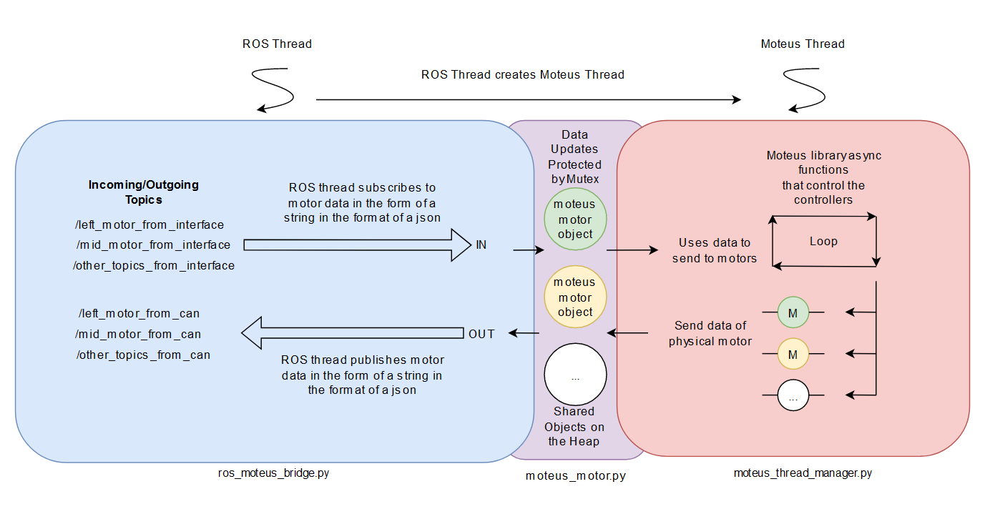

# The [`can_moteus`](https://github.com/TrickfireRobotics/urc-2023/tree/main/src/can_moteus) Package


## **What is it?**
This is a **ROS Node** that is responsible for communication between the [**Moteus motor controllers**](https://github.com/mjbots/moteus) (via a CAN-FD Bus) and **ROS** that the rest of the codebase is written in. 

Motors are created that represent their real-life counterparts that are connected to a Moteus controller. Each motor has a subscriber that gets data from the rest of the codebase (position, velocity, etc); and a publisher that sends data from the motor to the rest of the codebase (torque, power usage, voltage, etc). The data contained in these topics is a String in the format of a JSON.

The only structure inthe whole codebase that should be directing sending and reading data for these Moteus controllers would be the `RobotInterface` and the `RobotInfo`. See [`code_overview.md`](./code_overview.md) for a diagram. 


## **How to use it**
In order to add a new motor, make sure that the motor has a Moteus controller connected to it and is on the same CAN-FD bus. Modify `ros_moteus_bridge.py` in order to add a motor under the `createMoteusMotors()` method. See the following example.

```
self.threadManager.addMotor(<CANID>, "NAME OF MOTOR")
```

That's it. Simple as. Simple is.

## **JSON Data**
There are two different JSON data that is used; one for input and one for output.

### Input `moteus_data_in_json_helper.py`
The data contained here is used to set the data that the motor should be sending to the Moteus controller. By default, everything is set to `None` with the exception of `setStop` which is set to `True`. The parameter `setStop` disables the controller, thus allowing the motor to freely spin. 

### Output `moteus_data_out_json_helper.py`
The data contained here is used to set the results from the Moteus motors. By default, all varaibles are set to `None`. This should be used by the `RobotInfo` to process the raw data.


## **Deep Dive - How is `can_moteus` Implemented?**
The Moteus library uses Python's async features, but ROS does not work well with Python's async. As such, we make a new thread (`moteus_thread`) to handle the async functions. 

Moteus motor objects are created that store information about the data to send to the motor. This object is written by the `ROS thread` and read by the `Motues thread`; this object is on the heap and as such is shared between both threads. 

This is the flow of data:

1. Incoming (`"_from_interface"`) topics come in
2. ROS Thread updates data corresponding to that motor
3. Moteus Thread reads data corresponding to that motor
4. Moteus Thread sends data to the Moteus library
5. Moteus library returns data
6. Moteus thread sends this result data to the corresponding motor
7. The motor publishes this data

Here is a diagram showing off the structure of this package.

Note 7/2/2024: The mutex is not implemented correctly - as in it protects nothing and essentially does nothing. 




