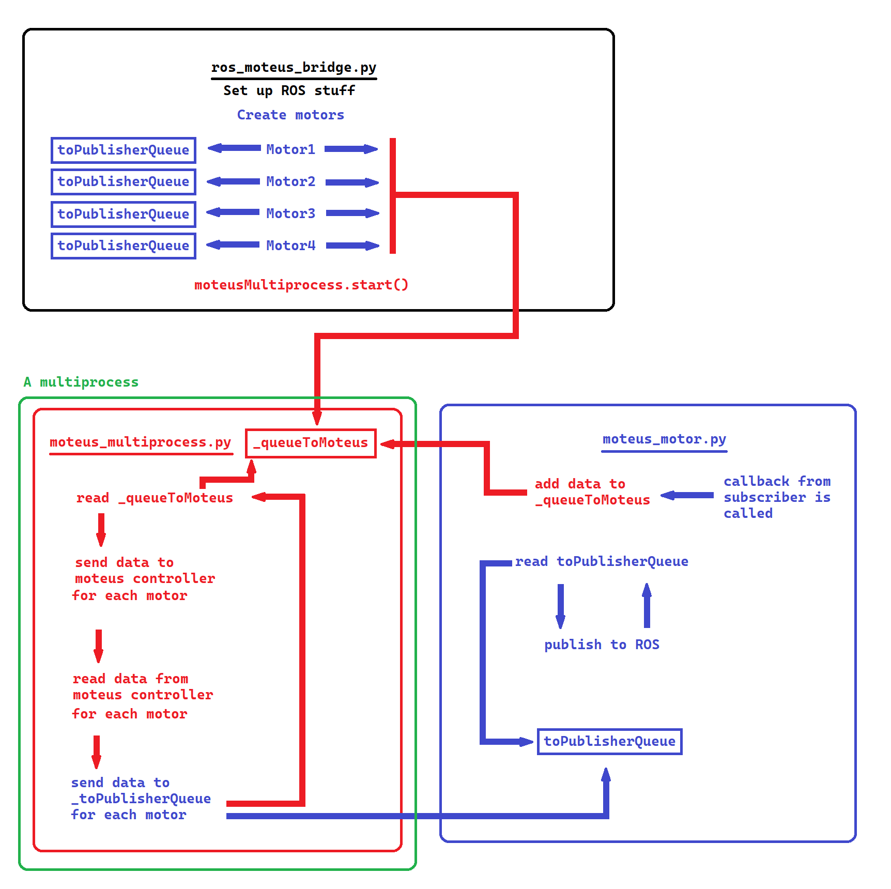

# The [`can_moteus`](https://github.com/TrickfireRobotics/urc-2023/tree/main/src/can_moteus) Package


## **What is it?**
This is a **ROS Node** that is responsible for communication between the [**Moteus motor controllers**](https://github.com/mjbots/moteus) (via a FDCAN/CAN Bus) and **ROS** that the rest of the codebase is written in. 

Motors are created that represent their real-life counterparts. Each motor subscribes to a topic that contains  data for the motors to use depending on the motor's mode; i.e. a motor in  VELOCITY mode would subscribe to data that would set that motor's velocity. Each motor can publish data to the ROS network that it reads from the Moteus controllers depending on what data the programmer wanted that motor to publish. 

The only structure in the whole codebase that should be directly sending data for these motors to subscribe to is the [`RobotInterface`](../src/interface); see [`code_overview.md`](./code_overview.md) for a diagram. 

## **How to use it**

### **CAN IDs**

Each Moteus controller is identified with a CAN ID.

Moteus controllers with lower CAN ID numbers have higher priority and will get messages before motors with higher CAN ID numbers.


The CAN IDs we use are as follows:

| Arm | Drivebase | Antenna | Life Detection |
|:---:|:---------:|:-------:|:--------------:|
| 1-9 |   20-29   |  40-49  |     60-69      |


Moteus controllers don't support CAN ID 0.


### **Adding a Motor in Code**
As each Moteus controller is connected to **only a single** motor, each motor is represented as a [`MoteusMotor`](../src/can_moteus/can_moteus/moteus_motor.py) object. However, the [`MoteusMultiprocess`](../src/can_moteus/can_moteus/moteus_multiprocess.py) object, of which only one should exist, handles these `MoteusMotors`. As such, motors are added via the `MoteusMultiprocess` object inside [`ros_moteus_bridge.py`](../src/can_moteus/can_moteus/ros_moteus_bridge.py).

To create a motor, we need to pass in the following parameters in this order:
- The CAN ID of the motor. This is an **integer**
- The name of the motor. This is a **String**
- The motor mode. This is a **moteus_motor.Mode**
- A list of data to publish to the ROS network. This is an **array of moteus.Register**

Here is an example of adding a motor

```
moteusPubList = [moteus.Register.VELOCITY, moteus.Register.POSITION]

moteusMultiprocess.addMotor(
    3,
    "topmotor",
    moteus_motor.Mode.VELOCITY,
    moteusPubList,
)
```
This motor has a CAN ID of **three** with the name **"topmotor"**. The motor is running in **VELOCITY** mode, and as such expects incoming data intended for the motor to set its velocity in Moteus units. Each time the motor reads data from the Moteus controller, it will publish its **VELOCITY** and **POSITION** values to the ROS network in Moteus units. 


### **Inputs**

When a motor is created, it will create a ROS subscriber to the following topic:

```<name of the motor>_<the data being recieved as per the mode>_from_robot_interface``` 

For example, using the motor above, it would subscribe to the topic of: 

```/topmotor_velocity_from_robot_interface```

The data sent to this topic will control the particular motor that it is sent to. Keep in mind that this data has to be formatted in Moteus units. 

Every cycle (every 0.02 seconds), the motor will send the last recieved data to send to the Moteus controller. The default is a value of **zero.** 

**NOTE: All subscribers and publishers handle data in std_msgs.msg.Float32**

### **Outputs**
When a motor is created, it will publish to the following topic(s) depending on the **moteus.Register array** that was passed in. The topic is in the following format:

```<name of the motor>_<the data being sent via moteus.register>_from_can```

For example, using the motor above, it would publish to the topics of:

```/topmotor_velocity_from_can```

```/topmotor_position_from_can```

Every cycle (every 0.02 seconds), the motor would read data it recieved from the Moteus controller and publish it. 

**NOTE: All subscribers and publishers handle data in std_msgs.msg.Float32**

**NOTE: The data that can be sent must match up exactly to the data that the Moteus controllers send back; which is precisely the values from [`moteus.Register`](https://github.com/mjbots/moteus/blob/38d688a933ce1584ee09f2628b5849d5e758ac21/lib/python/moteus/moteus.py#L148)!**

## **What is a Moteus Unit?**

The documentation for the Moteus units are found [here](https://github.com/mjbots/moteus/blob/main/docs/reference.md#a2-register-usage). Each type of data has different units, so keep that in mind.


## **Deep Dive - How is `can_moteus` Implemented?**

### **Overview**
The core idea is that there are two distinct Python processes running that communicate with each other via several different multiprocess queues. The first process is the "main" process where ROS lives and does whatever it needs to do. The second process is started by us and is used to send and read data to the Moteus controllers. 

### **Queue From Motors to Moteus Multiprocess**

Each motor's callback function for their subscribers writes to the `_queueToMoteus` queue (created in `moteus_multiprocess.py`), where only one such queue exists. As such, all motors share this queue. The data that is enqueued is an array of length two in the following format:

```
[0] = CANID
[1] = data (position, velocity, etc)
```

### **Queue From Multiprocess to Each Motor**
Each motor has its own multiprocess queue, `toPublisherQueue` that is created in `moteus_multiprocess.py`, which is then populated by the Moteus multiprocess for each corresponding motor. The type of data that is sent is dictated by the `moteusPubList` array as seen earlier in the example motor. The data that is enqueued is an array of length two in the following format:

```
[0] = moteus.Register
[1] = data (position, velocity, voltage, current, etc)
```

### **The Multiprocess Cycle**
Each cycle, 0.02 seconds, the Moteus multiprocess reads the head of the `_queueToMoteus` and updates the set value for the target motor. It then goes through each motor that was succesfully connected to the CAN/CANFD bus and sends their set data. At the same time, it recieves information about the Moteus controller and populates each motor's `toPublisherQueue`.

Here is a diagram of the process:

