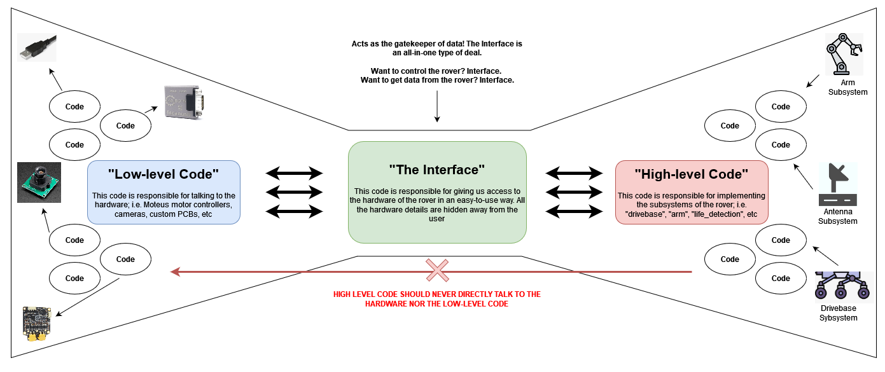
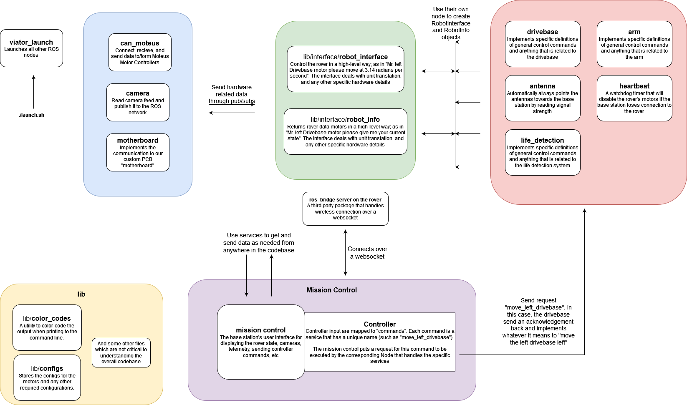

# Code Overview

## Introduction
Most of the codebase is written in Python as the language is easier to develop in and has more third-party libraries compared to C++. However, that does
not mean that C++ cannot be used - it depends on the needs. The code uses Docker in order to standardize the working environment in which code runs,
this making it easier for you to develop and deploy code on the rover. 

The code is split into two Github repositories: urc-2023 and mission-control. Keep in mind that the mission control breaks the code design a little as
it is not running on the rover computer but rather over the network on your laptop! The mission control should never represent the state of the rover. 

## The Core Idea

The code is split into three parts:

1. **Low-level code** -> This deals with the funky hardware communication such as USB, CAN bus, Wi-Fi, etc. It prepares publishers/subscribers for the interface to use

2. **The interface** -> This deals making it easy to interact with the rover by exposing functions such as `runMotor()` or `getMotorState()`

3. **High-level code** -> This implements the subsystems found on the rover. It directly talks to the interface in order to get the rover to physical do things. 
Notice how the high-level code does not care about the hardware, thus making it easier to focus on the **algorithms** rather than fighting the hardware.

## Mission Control
The mission control is a piece of software that allows us to interact with the rover over a browser as it is written in Vue.js/Typescript. 
Cameras, controller input, telemetry data, controlling motors, life-detection results, and so on are all shown here. 

A very important concept is that the mission control acts as a **CLIENT** when sending and getting data from the rover. This means that the mission control
should never represent the current state of the rover; i.e. you cannot represent what mode the arm is in (individual motor control, disabled, inverse kinematics, etc)
in the mission control 

One very good thing about the mission control is that it has access to the ROS network, which allows us to use subscribers, publishers, and services. All data that 
is sent between the rover and the mission control are ROS services. The mission control requests and the rover responds. Using services will also allow us to
determine if data was dropped while transmitting across the Utah desert. 

## Quick Description of the Packages
### arm ("high-level")
Implements the arm in different control types such as individual motor control (via velocity or position), inverse kinematics, and so on. 
### can_moteus ("low-level")
Interacts with the Moteus Field Oriented BLDC motor controllers. This code is able to update the motor controller configs, send data to the motor, read data from the motor,
and handle CAN-FD bus issues. 
### custom_interfaces (misc)
This code is used to create custom publisher/subscriber and service payloads. 
### lib (misc and "the interface")
Contains commonly used functionality throughout the codebase. This is the home to "the interface" code as well under the folder `\interface`
### viator_launch (misc)
This code launches all ROS nodes found in our codebase. It is analogous to the `main()` entry point functions in most programming languages. 

## Putting It All Together

