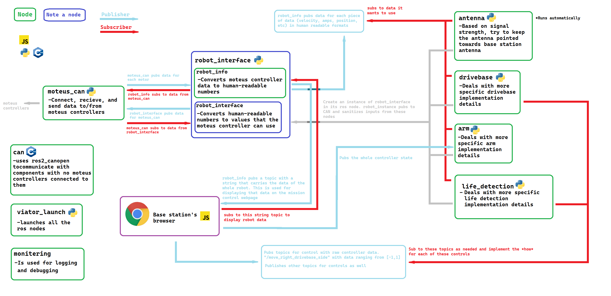

# **Code Overview**

Most of the codebase is written in Pyton due as most of the other components are coupled (depend on) the `robot_interface` class to control the robot. However, Python is easier to develop in and has more third-party libraries compared to C++. 

## **Diagram**

## **Components of the CodeBase**
### **CAN Related**

### **`can_moteus`**
[Docs link](./can_moteus.md)

This is a **ROS Node** that is responsible for communication between the [**Moteus motor controllers**](https://github.com/mjbots/moteus) (via a FDCAN/CAN Bus) and **ROS** that the rest of the codebase is written in. 

### **`robot_interface`**
This is responsible for converting human units into Moteus units that the Moteus controllers can understand. This is **not** a ROS Node, and instead will be an object that **takes in** a ROS Node to subscribe to data published by `can_moteus`. There are a long list of methods that correspond to the functionality of the rover; i.e. `setBottomArmMotorAngle(123)` would set the angle of the bottom motor of the arm to 123 degrees.

### **Robot Functionality**

### **`antenna`**
This is responsible for pointing the robot antenna to always point to the base station's antenna to secure the strongest WiFi signal.

### **`drivebase`**
This is responsible for implementing *how* a drivebase should work depending on user input. 

Through a subscriber, it will recieve signals to when execute a high level control scheme: "move left side", "move right side", "move forwards", etc.

### **`arm`**
This is responsible for controlling the arm via high level control schemes using inverse-kinematics. 

### **`life_detection`**
This detects life somehow. The physical design is still in progress

### **Base Station**
### **`mission_control`**
This will host a webpage through sockets utilizing rosbridge to expose ROS-like behavior. The webpage will display information about the rover in addition to video output. The webpage will also sent controller input to the ROS network.

### **Miscellaneous**

### **`viator_launch`**
This launches all of the ROS nodes in our code. If you want to add a node, make sure to update the [`robot.launch.py`](../src/viator_launch/launch/robot.launch.py) and the [`package.xml`](../src/viator_launch/setup.py) files. 

### **`can`**
This is responsible for using the CANOpen protocol using the [ros2_canopen](https://github.com/ros-industrial/ros2_canopen) library to communicate between a few parts of the rover which cannot use the moteus controllers. 

### **`monitering`**
This is planned to be utilized as a logging system. This might or might not be removed

