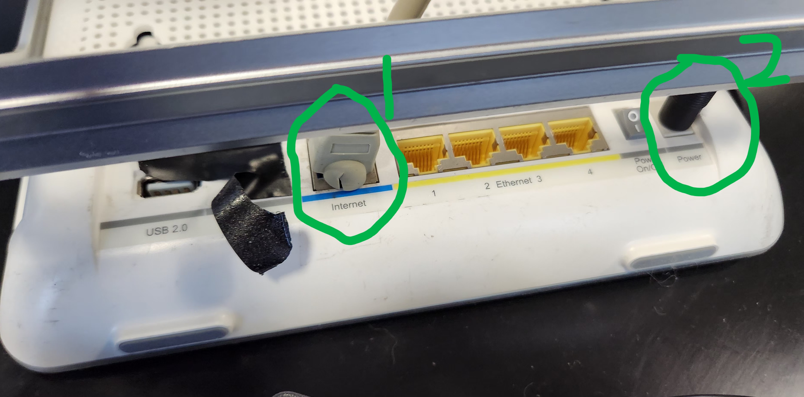
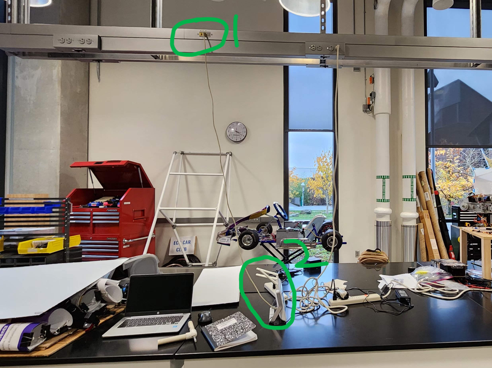
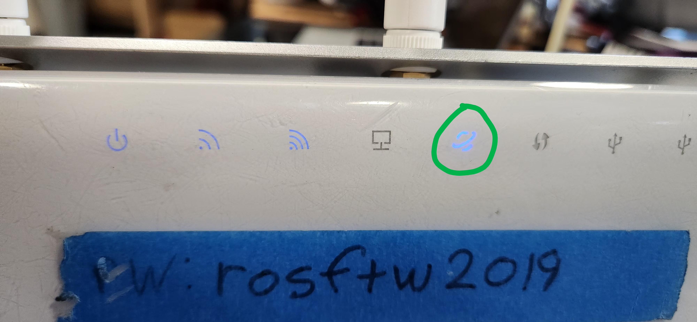

Updated on 10/10/2024
# Executing Code on the Real Rover

Executing code is quite easy, this will walk you through the steps. The general steps are as follows:

1) Turn on the rover's computer (Orin), wait for it to boot up.
2) Connect to the correct router
3) SSH (secure shell) into the rover
4) Change your directory into the folder with the code
5) Execute a few bash scripts


## Turning On the Orin
We need to power the Nvidia Jetson Orin, the main computer, with either its native wall plug or through a battery. The Orin will have a small white LED that turns on if it is getting power.

```
Q: Which one do I use? 
A: If testing for a LONG time without needing the rover to physically move around, use the wall plug. If you want the rover to move around, perhaps outside or in the lab, use the battery.
```

| 12v Battery | Wall Plug |
| ---- | ---- |
| imge |  |

## Connecting to the Correct Router
There are two routers that you will deal with - the white one (sometimes called the "development router") and the grey one (sometimes called the "rover's router"). Each one has a different IP you connect with a different set of passwords for the router as well. 

TABLE 1: Router Info
| Value | White | Grey |
| ---- | ---- | ---- |
| Wi-Fi Name | `trickfirerouter` | `viator` |
| Wi-Fi Password | `rosftw2019` | `goodlife` |
| Admin Username | `trickfirerouter` | `N/A` |
| Admin Password | `adminpasswordro` | `N/A` |
| Software's Orin IP | `192.168.0.145` | `10.0.0.10` |
| Electrical's Orin IP | `192.168.0.145` | `N/A` |

| Orin's Passwords | `trickfire` |


```
Q: Which one do I use?
A1: Use the white router if you need internet access on your laptop or if the Orin needs internet access. The white router is directly connected to UW's network via an Ethernet cable.
A2: Use the grey router if you want to drive the rover around the lab or outside. This will remove internet access. 
```

### Step 1 - Connecting
Connect to the network by connecting to the wifi (see Table1 for credentials). This may be done already for you.

If using the white router:
Connect ethnet able and power cable below:

connect the ethernet cable to the router and the ethernet plug that is located overhead above the tables in the middle to like in 1 in image below


If on Windows, open Powershell. If on Mac/Linux open the Terminal. Type in the following command and press enter:

`ssh trickfire@<ip of the Orin>` Example: `ssh trickfire@192.168.0.145`

**Note**
If this is your first time connecting to a new host, you will a message like this:

```
The authenticity of host...
Are you sure you want to continue connecting...
```
Type in `yes` and press enter.

### Step 2 - Password
If the command is successful, the terminal will as you to enter your password. Type in `trickfire`. **Note:** You will not see letters as you type, this is done for security. 

`trickfire@<ip of the Orin>'s password:`

Once written, press enter. You will see something like this:

`trickfire@trickfire-orin:~$`

You have succesfully remoted into the Orin. You are a master hacker.

## Executing Code

### Step 1 - Launching the Docker Container

Type in the following command.

`sudo ./master-urc-2023/urc-2023/container_launch.sh -m`

Once written, press enter. You will see something like this:

`root@trickfire-orin:/home/trickfire/urc-2023#`

This means you have succesfully launched the Docker Container.

### Launching the Rover Code

Type in the following command.

`./build.sh; ./launch.sh`

Once written, press enter. You will something like this. The first part is building the code; once that is finished it will launch the code.

```
Starting >>> can_moteus
Starting >>> custom_interfaces
Starting >>> example_node
Starting >>> mission_control_updater
Starting >>> drivebase
Starting >>> heartbeat
Finished <<< custom_interfaces [2.36s]
Starting >>> arm
--- stderr: example_node...


Summary: 8 packages finished [6.02s]
  7 packages had stderr output: arm can_moteus drivebase example_node heartbeat mission_control_updater viator_launch
[INFO] [launch]: All log files can be found below /root/.ros/log/2024-10-11-02-30-52-838395-trickfire-orin-2641
[INFO] [launch]: All log files can be found below /root/.ros/log/2024-10-11-02-30-52-838520-trickfire-orin-2642
[INFO] [launch]: Default logging verbosity is set to INFO
[INFO] [launch]: Default logging verbosity is set to INFO
[INFO] [can_moteus-1]: process started with pid [2643]
[INFO] [drivebase-2]: process started with pid [2645]...
```
