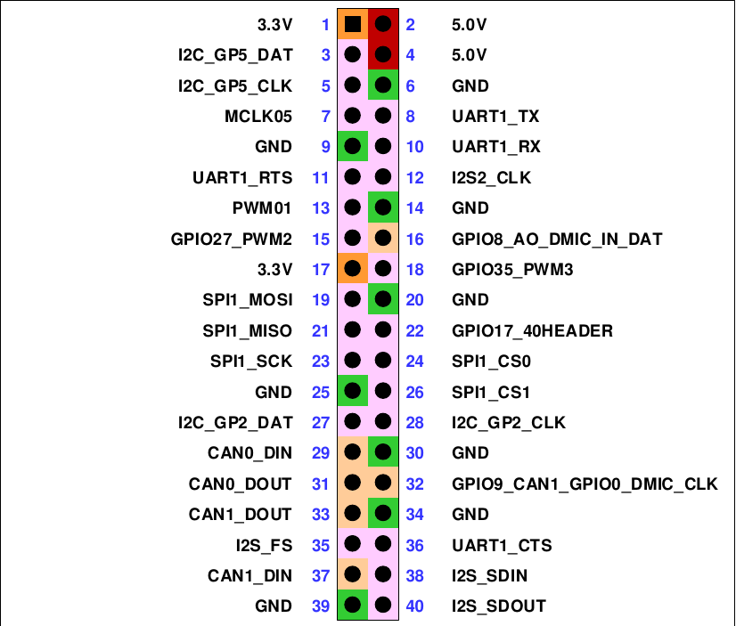
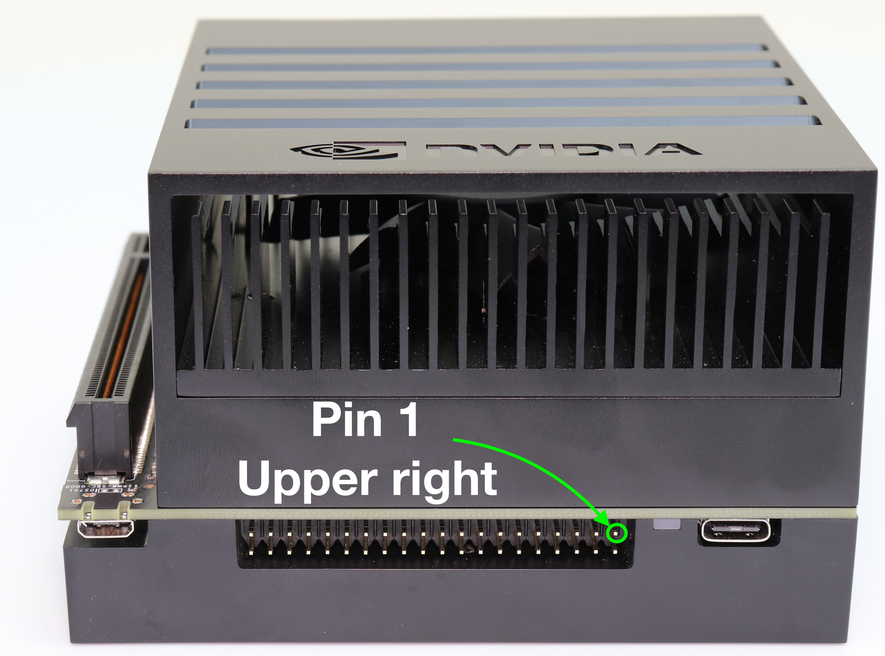
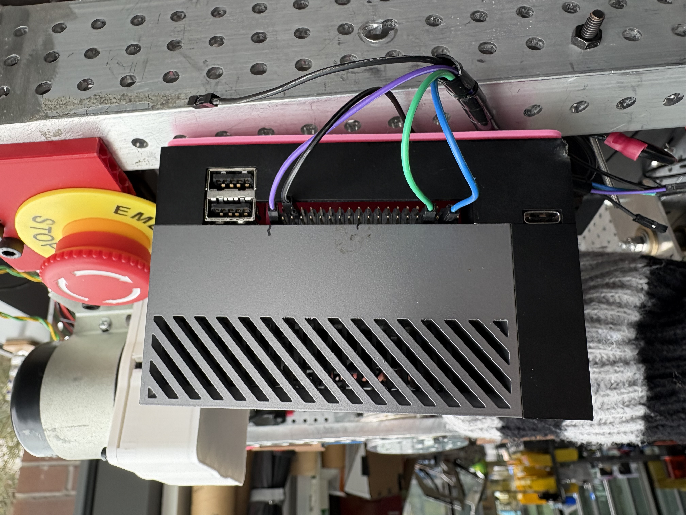

The rover's onboard computer is a [Jetson AGX Orin 32GB](https://www.nvidia.com/en-us/autonomous-machines/embedded-systems/jetson-orin/#tech-specs), running [JetPack 5.1](https://developer.nvidia.com/embedded/jetpack-sdk-51) on top of [Ubuntu 20.04 "Focal Fossa"](https://www.releases.ubuntu.com/focal/). This page covers the expansion header pinout, how to wire the rover's CAN/power cables to it, and a display gotcha that trips people up when bringing up a monitor for the first time.

## Wiring the rover harness

The rover connects to the Orin's expansion header with 5 cables:

| Cable      | Signal | Connect to  |
| ---------- | ------ | ----------- |
| Black (x2) | Ground | `GND`       |
| Purple     | Power  | `3.3V`      |
| Blue       | CAN RX | `CAN1_DIN`  |
| Green      | CAN TX | `CAN1_DOUT` |

<Callout type="warning" title="Double-check pin 1 before connecting">
    The header isn't keyed, so it's easy to plug the harness in a row off. Confirm pin 1 (upper
    right, per the pinout above) before connecting power — a misaligned connector can put 3.3V where
    ground is expected.
</Callout>

<h2 style={{ textAlign: "center" }}>Pinout</h2>

<Image width="60%"></Image>

**Pin 1** is in the **upper right** of the header.

<Image width="60%"></Image>

<h2 style={{ textAlign: "center" }}>Example Wiring</h2>

<Image width="60%"></Image>

## Display compatibility

The Orin only outputs native DisplayPort. Most monitors won't work with it unless they have a DP input — passive DP-to-HDMI cables generally don't work, because the DisplayPort and HDMI connector shapes aren't compatible with a simple adapter cable (it requires active protocol conversion, not just a different plug). Use a monitor with a native DP socket, or a proper active DP-to-HDMI adapter, when bringing up a display on the Orin.
